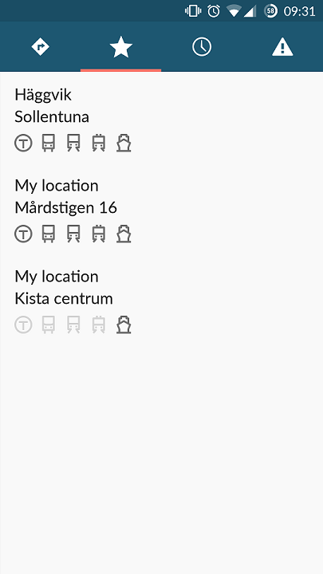

# Favorites and Journey history
All favorites (starred journeys) are entries in the journeys table in journeys.db whose "starred" column is set to 1. This database file is primarily handled by JourneysProvider. The same file stores recent journeys.
Journeys are starred or unstarred by toggling the star icons in the PlannerFragment view or the RoutesActivity view.
All starred journeys are loaded and displayed in the FavoritesFragment view.  
The class FavoritesDbAdapter and corresponding database favorite.db seem to only exist for backwards compatibility and are not used.


The journey_data column contains JSON data about the journey. Example:  
```
{"transportModes":["MET","BUS","WAX","TRN","TRM"],"alternativeStops":false,"origin":{"id":"1094","name":"Körsbärsvägen","latitude":59348411,"longitude":18064758,"source":0,"locality":"Stockholm"},"destination":{"id":"9204","name":"Tekniska högskolan","latitude":59345543,"longitude":18071707,"source":0,"locality":"Stockholm"}}
```

## PlannerFragment


  
The five latest journeys are displayed here, in order of most recently modified. Non-starred journeys outside of the 5 most recent are deleted, but even starred journeys are not preferentially displayed here.  

Code relating to the toggling of favourites is found in the function inflateView, around line 730. 


## RoutesActivity


The currently viewed journey can be starred here. Pressing the star icon (actionbar_item_star) calls the function handleStarAction (around line 934) which toggles the "starred" value in the database. This Activity class also handles general calling of the journeys database in updateJourneyHistory (around line 966).


## FavoritesFragment



All starred journeys in the database are fetched and listed here.\
Pressing and holding, then selecting Delete, deletes an entry as follows:
```java
getActivity().getContentResolver().delete(ContentUris.withAppendedId(Journeys.CONTENT_URI, menuInfo.id),null, null);
```
