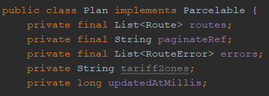
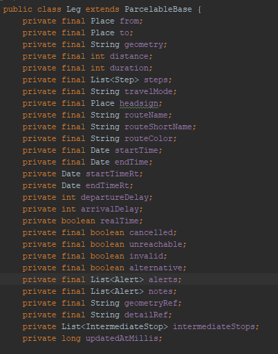
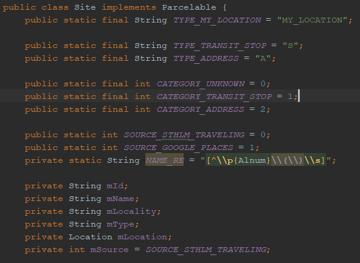
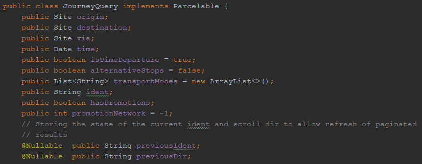

# Objects

## Plan
  
The plan object consists of:  
- A list of routes  
- A long describing how many miliseconds ago it was updated  
- A list of routeError objects.  

The plan object is used to list the available routes from one location to another.  

## Route
  
The route object consists of:  
- An int called "Duration" describing how long the trip will take  
- A list of leg objects  
- A string "mode" describing the different traveling modes  
- A boolean "Fare" describing if ticket purchases can be made for this trip  

The route is used to describe how the different trips look, e.g. how long it takes, if it goes by boat or train etc...  

## Leg
  
The leg object consists of information that the route uses to display the different parts of the trip to the user.  
For example if a user needs to take a bus and a train afterwards this would result in two separate legs.

## IntermediateStop
  
The intermediate stop is used during trips if the route requires the user to switch between two legs and wait for a period inbetween.
The intermediate stop object consists of:  
- A location describing in GPS coordinates where the stop is  
- A starttime stating when the stop "starts"
- A starttime in realtime stating in realttime when the stop "starts"
- A stoptime stating when the trip continues
- A stoptime in realtime when the trip continues

## Site
  
The site consists of:  
- A String" mID", an id for the site
- A string" mName", the name of the site
- A string "mLocality", name of the municipality the site is located in
- A string "mType", describing if the site is an adress or a transit stop
- A location "mLocation", gps coordinates for the site
- An int "mSource", describing if the site came from STHLM_traveling or google places

The site is what is used in journeyqueries to describe where we are and where we want to go, this is relayed to the STHLM_traveling API.

## TravelMode 
Consists of a string corresponding to a travel mode (ie. bus, train etc.)
## TravelModeQuery
Consists of a list with TravelMode objects
## JourneyQuery 

  

Journeyqueries hold information needed to ask the STHLM-travel API for available routes.
Essentially the Journeyquery is a request, "I want to go from here to here at a certain time". Journeyqueries are what is used to produce plan objects.
